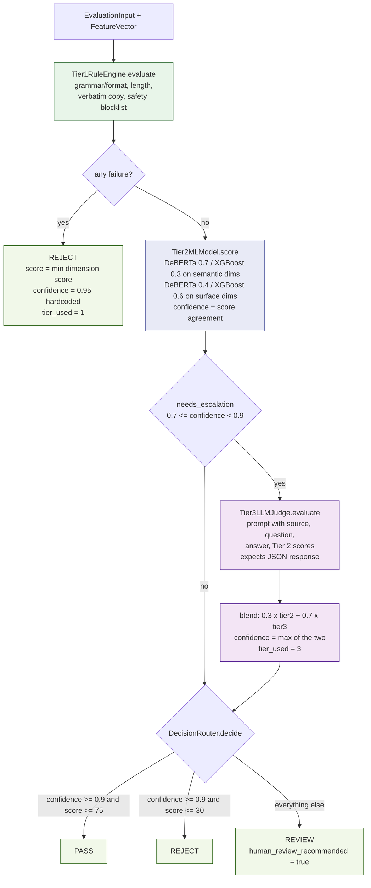
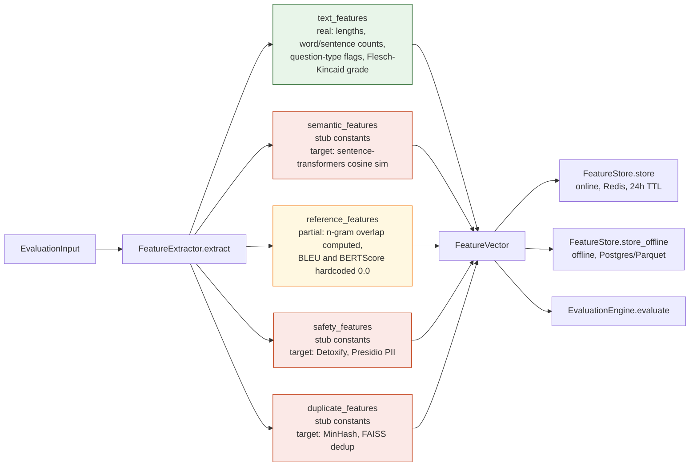
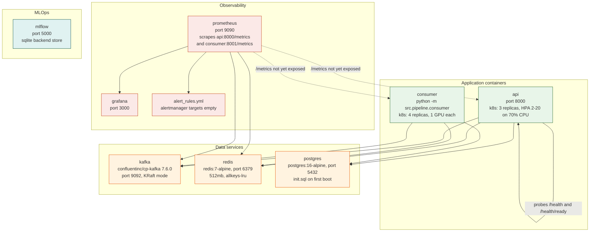
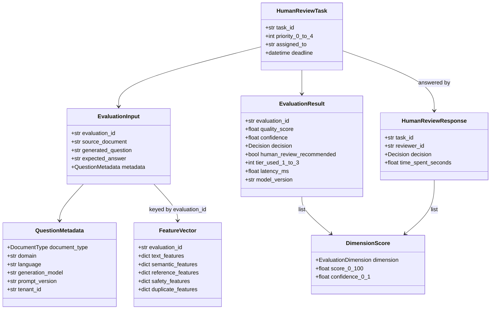

# Code Architecture (as-implemented)

This diagram describes the architecture **as it exists in `src/`** today.

It is deliberately different from [`system-architecture.md`](system-architecture.md), which
documents the *target* production design. Where the target design names infrastructure that
the code does not yet call (Ray, Airflow, DVC, FAISS, ELK, PagerDuty, Review UI), that
component is omitted here or marked as a stub.

---

## 1. Modules and call graph

Solid arrows are calls that exist in code. Dashed arrows are integrations that are written
as commented-out code or `pass` bodies, so they do not execute yet.

```mermaid
graph TB
    subgraph Entry["Entry points"]
        MAIN["src/api/main.py<br/>FastAPI app, uvicorn"]
        CONS["src/pipeline/consumer.py<br/>EvaluationConsumer"]
        BATCH["src/pipeline/batch_evaluator.py<br/>BatchEvaluator CLI"]
    end

    subgraph Routes["src/api/routes"]
        RH["health.py<br/>GET /health<br/>GET /health/ready"]
        RE["evaluation.py<br/>POST /api/v1/evaluate<br/>GET /api/v1/evaluate/:evaluation_id<br/>POST /api/v1/evaluate/sync"]
        RB["batch.py<br/>POST /api/v1/batch/evaluate<br/>GET /api/v1/batch/:batch_id"]
        RE["evaluation.py<br/>POST /api/v1/evaluate<br/>GET /api/v1/evaluate/{id}<br/>POST /api/v1/evaluate/sync"]
        RB["batch.py<br/>POST /api/v1/batch/evaluate<br/>GET /api/v1/batch/{id}"]
    end

    subgraph Features["src/features"]
        FX["extractor.py<br/>FeatureExtractor.extract"]
        FST["store.py<br/>FeatureStore"]
    end

    subgraph Eval["src/evaluation"]
        ENG["engine.py<br/>EvaluationEngine.evaluate"]
        T1["tier1_rules.py<br/>Tier1RuleEngine"]
        T2["tier2_ml.py<br/>Tier2MLModel"]
        T3["tier3_llm.py<br/>Tier3LLMJudge"]
        DR["decision_router.py<br/>DecisionRouter"]
    end

    subgraph Shared["src/utils"]
        CFG["config.py<br/>AppConfig via pydantic-settings"]
        MOD["models.py<br/>Pydantic domain models"]
    end

    subgraph Detached["Implemented but not yet called by any entry point"]
        HRR["human_review/router.py<br/>ReviewRouter"]
        HRF["human_review/feedback.py<br/>FeedbackCollector"]
        MET["monitoring/metrics.py<br/>MetricsCollector"]
        DRIFT["monitoring/drift_detector.py<br/>DriftDetector"]
        TRN["training/trainer.py<br/>ModelTrainer"]
    end

    subgraph Ext["External systems"]
        KAFKA["Kafka<br/>evaluation-requests<br/>scoring-results<br/>feedback-events"]
        REDIS["Redis<br/>online features, review queue"]
        PG["PostgreSQL<br/>results, reviews"]
        LLM["OpenAI / Anthropic"]
        MLF["MLflow registry"]
        S3["S3 dead letter queue"]
    end

    MAIN --> RH
    MAIN --> RE
    MAIN --> RB
    MAIN --> CFG

    CONS --> FX
    CONS --> FST
    CONS --> ENG
    CONS --> CFG
    BATCH --> FX
    BATCH --> ENG
    BATCH --> CFG

    ENG --> T1
    ENG --> T2
    ENG --> T3
    ENG --> DR
    T3 -->|"imports Tier2Result as input type"| T2
    T3 --> T2

    CFG --> ENG
    CFG --> T2
    CFG --> T3
    CFG --> DR
    CFG --> FST
    MOD --> ENG
    MOD --> FX
    MOD --> RE

    RE -.->|"publish, commented out"| KAFKA
    RE -.->|"query results, commented out"| PG
    CONS -.->|"AIOKafkaConsumer, commented out"| KAFKA
    CONS -.->|"DLQ, commented out"| S3
    FST -.->|"redis.asyncio, commented out"| REDIS
    FST -.->|"store_offline, pass"| PG
    T2 -.->|"DeBERTa + XGBoost load, commented out"| MLF
    T3 -.->|"chat completions, commented out"| LLM
    HRR -.->|"XADD review-queue, commented out"| REDIS
    HRF -.->|"INSERT reviews, pass"| PG
    TRN -.->|"register_model, commented out"| MLF

    classDef entry fill:#e8f5e9,stroke:#1b5e20
    classDef route fill:#e1f5fe,stroke:#01579b
    classDef eval fill:#e8eaf6,stroke:#1a237e
    classDef feat fill:#fce4ec,stroke:#880e4f
    classDef shared fill:#f5f5f5,stroke:#212121
    classDef detach fill:#fff8e1,stroke:#f57f17,stroke-dasharray: 4 3
    classDef ext fill:#fbe9e7,stroke:#bf360c

    class MAIN,CONS,BATCH entry
    class RH,RE,RB route
    class ENG,T1,T2,T3,DR eval
    class FX,FST feat
    class CFG,MOD shared
    class HRR,HRF,MET,DRIFT,TRN detach
    class KAFKA,REDIS,PG,LLM,MLF,S3 ext
```



### Two independent paths reach the engine

`EvaluationEngine` is constructed in exactly two places: `EvaluationConsumer.__init__`
and `BatchEvaluator.__init__`. The HTTP routes do **not** construct or call it — including
`POST /api/v1/evaluate/sync`, which builds a hardcoded `EvaluationResult` inline.

---

## 2. Evaluation engine control flow

Thresholds shown are the defaults in `ThresholdConfig` (`src/utils/config.py`), overridable
via `THRESHOLD_*` environment variables.



Two behaviours worth knowing when reading this flow:

- **Escalation is a middle band, not a floor.** Confidence below `0.7` does *not* escalate to
  the LLM; it goes straight to `REVIEW`. Only the uncertain `0.7`–`0.9` band pays for Tier 3.
- **`decide` has no distinct borderline branch.** The last two conditions in
  `DecisionRouter.decide` both return `REVIEW`, so REVIEW is effectively the default for
  anything that is not a confident pass or a confident reject.

### Tier 3 is unreachable while Tier 2 is stubbed

Confirmed by running the batch pipeline. `Tier2MLModel._run_deberta` returns a constant `75.0`
and `_run_xgboost` returns a constant `70.0` for every dimension, so the agreement-based
confidence is fixed:

```
agreement  = 1.0 - |75 - 70| / 100          = 0.95
confidence = min(0.95, 0.95 * 0.9 + 0.1)    = 0.95
```

`0.95` sits above the escalation ceiling of `0.9`, so `needs_escalation` is always false and
`Tier3LLMJudge` never runs. The blended score is likewise fixed at `72.87`, which is below
`pass_score_min` of `75.0`. Net effect in placeholder mode: every question that clears Tier 1
returns `REVIEW` at `tier_used = 2`, and both the Tier 3 path and the PASS branch are dead
until a real Tier 2 model produces varying confidence.

Observed on a two-question sample: a well-formed question returned
`score=72.87, confidence=0.95, decision=review, tier_used=2`; a question missing its question
mark returned `score=30.0, decision=reject, tier_used=1`.

---

## 3. Feature extraction

`FeatureExtractor.extract` populates the five dicts on `FeatureVector`. The text features are
computed for real; the other four groups currently return constants where a model would be
loaded in production.



---

## 4. Runtime topology

This is what `docker-compose.yaml` actually starts, plus the two workloads in
`infrastructure/k8s/deployment.yaml`.



`prometheus.yaml` scrapes `/metrics` on both app containers, but `src/api/main.py` mounts only
the health, evaluation, and batch routers, and `MetricsCollector` does not import
`prometheus_client` yet. Those two scrape jobs will fail until an exporter is wired in.

---

## 5. Core data models

All inter-module contracts live in `src/utils/models.py` as Pydantic models, which is why the
tiers can stay decoupled from transport.



`EvaluationDimension` defines the ten scored dimensions: correctness, groundedness,
relevance, difficulty, clarity, completeness, non-duplication, hallucination, bias/safety,
grammar. `Decision` is `pass | review | reject`.

---

## 6. Implementation status

| Module | Logic | External integration |
|---|---|---|
| `api/main.py`, `api/routes/health.py` | Complete | n/a |
| `api/routes/evaluation.py` | Validation only; results are hardcoded | Kafka publish and DB read commented out |
| `api/routes/batch.py` | Returns fixed placeholders | S3 validation and Airflow trigger commented out |
| `evaluation/tier1_rules.py` | Complete and unit tested | n/a, pure Python |
| `evaluation/decision_router.py` | Complete and unit tested | n/a, pure Python |
| `evaluation/engine.py` | Complete orchestration and blending | depends on tier stubs |
| `evaluation/tier2_ml.py` | Ensemble weighting and confidence math real | model loading and inference commented out |
| `evaluation/tier3_llm.py` | Prompt build and JSON parse real | LLM API call returns canned JSON |
| `features/extractor.py` | Text features real, rest constant | embedding and safety models commented out |
| `features/store.py` | Interface only | Redis and Postgres commented out |
| `pipeline/consumer.py` | `process_message` orchestration real | Kafka consume, DB write, DLQ commented out |
| `pipeline/batch_evaluator.py` | Runs end to end on a local JSONL file | reads and writes local files, works today |
| `human_review/router.py` | Priority and deadline logic real | Redis Streams enqueue commented out |
| `human_review/feedback.py` | Agreement and escalation logic real | all persistence is `pass` |
| `monitoring/drift_detector.py` | KL-divergence and thresholds real, uses numpy | no caller |
| `monitoring/metrics.py` | Metric names enumerated only | `prometheus_client` not imported |
| `training/trainer.py` | Pipeline sequence and gating real | data load, training, MLflow all stubbed |

## 7. Wiring gaps

These are the edges the target design assumes but the code does not yet contain:

1. **API to engine.** No route reaches `EvaluationEngine`. Only the Kafka consumer and the
   batch CLI do.
2. **REVIEW decision to review queue.** `EvaluationEngine` sets
   `human_review_recommended`, but nothing calls `ReviewRouter.create_review_task`. The
   decision and the queue are not connected.
3. **Feedback to training.** `FeedbackCollector._finalize_decision` logs and returns;
   `ModelTrainer` has no caller and no trigger.
4. **Metrics emission.** `MetricsCollector` is never instantiated, and no `/metrics`
   endpoint exists despite Prometheus being configured to scrape one.
5. **Drift to retraining.** `DriftAlert.should_retrain` is computed but never consumed.

The only path that runs end to end today is
`python -m src.pipeline.batch_evaluator --input questions.jsonl`, which exercises feature
extraction, all three tiers, and decision routing entirely in process.
