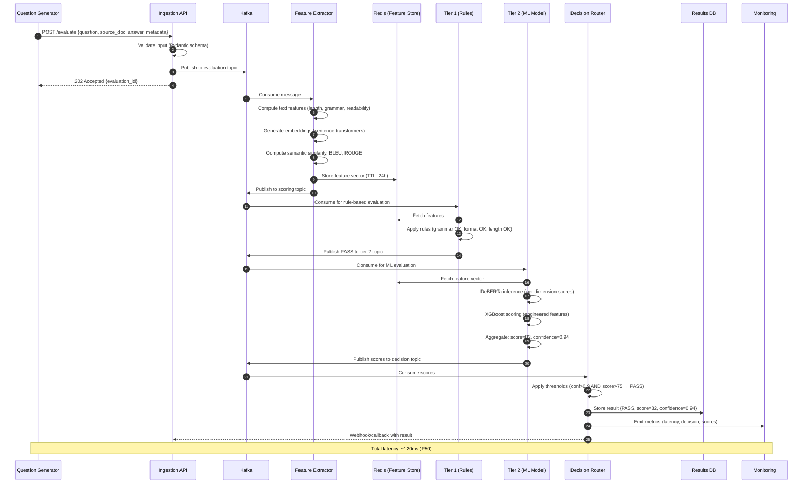
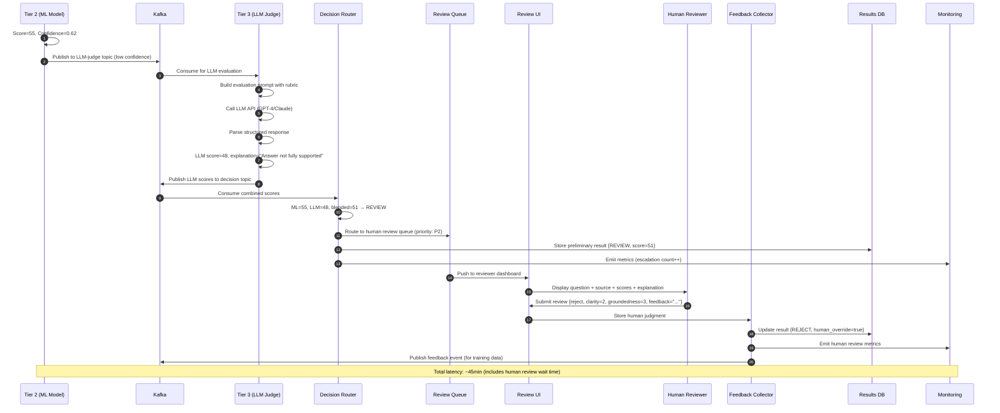
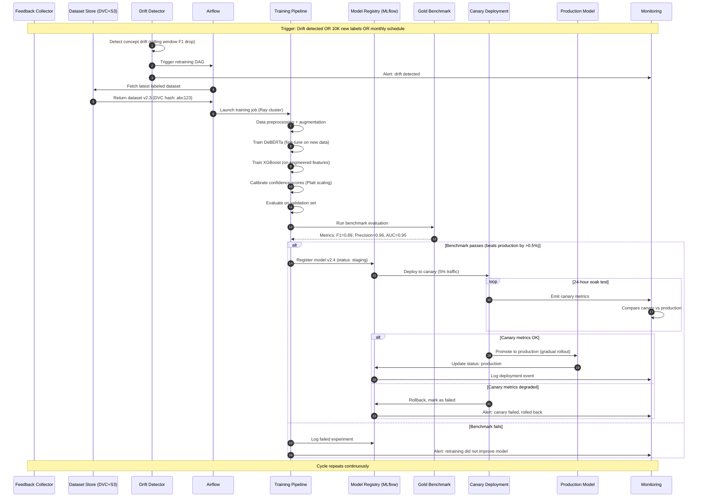
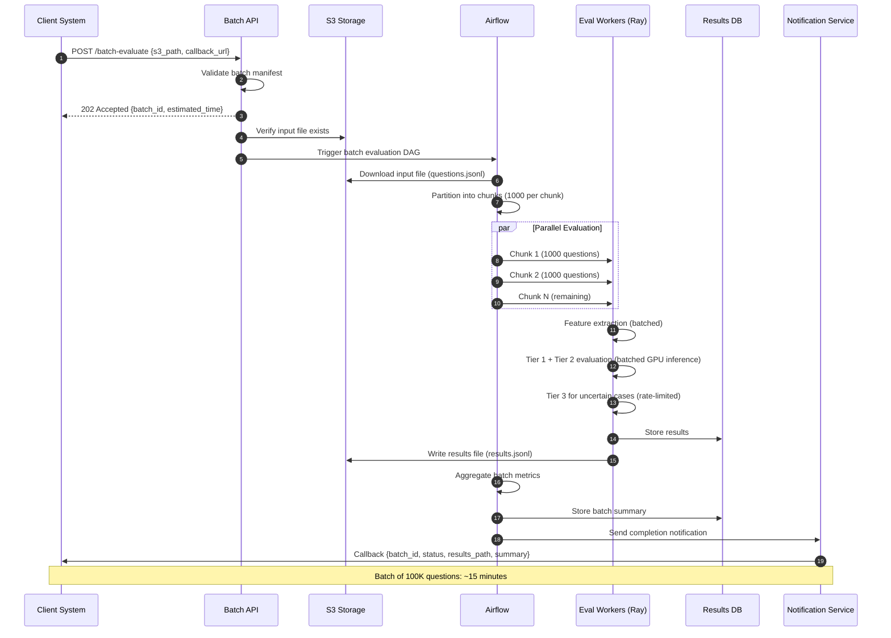

# Sequence Diagrams

## 1. End-to-End Evaluation Flow (Happy Path — Auto Pass)




## 2. Uncertain Case — Escalation to LLM Judge + Human Review




## 3. Feedback Loop — Model Retraining




## 4. Human Review — Disagreement Resolution

```mermaid
sequenceDiagram
    autonumber
    participant RQ as Review Queue
    participant R1 as Reviewer 1
    participant R2 as Reviewer 2
    participant R3 as Reviewer 3 (Tie-breaker)
    participant ADJ as Senior Adjudicator
    participant FC as Feedback Collector
    participant GOLD as Gold Dataset

    RQ->>R1: Assign question for review
    RQ->>R2: Assign same question (independent)

    R1->>FC: Submit: PASS (score: 72)
    R2->>FC: Submit: REJECT (score: 35)

    FC->>FC: Detect disagreement (PASS vs REJECT)
    FC->>RQ: Escalate to tie-breaker

    RQ->>R3: Assign for third review
    R3->>FC: Submit: REJECT (score: 40)

    FC->>FC: Majority vote: REJECT (2-1)
    FC->>FC: Flag for calibration (reviewer 1 outlier)

    alt High disagreement on specific dimension
        FC->>ADJ: Escalate to senior adjudicator
        ADJ->>FC: Final ruling + rationale
        FC->>GOLD: Add to gold dataset with expert label
    else Clear majority
        FC->>GOLD: Add to training set with majority label
    end

    FC->>FC: Update reviewer reliability scores
    FC->>FC: Log for inter-annotator agreement tracking

    Note over RQ,GOLD: Cohen's kappa monitored; retrain if < 0.7
```

## 5. Batch Evaluation Flow



## Latency Breakdown

| Path | Steps | P50 Latency | P99 Latency |
|------|-------|-------------|-------------|
| Auto Pass (Tier 1+2) | Ingest → Features → Rules → ML → Decision | 80ms | 200ms |
| LLM Escalation | Above + LLM call | 1.5s | 3s |
| Human Review | Above + queue wait + review | 30min | 4hr |
| Batch (per question) | Bulk features → Bulk inference | 15ms | 50ms |
| Retraining cycle | Drift detect → Train → Deploy | 4hr | 8hr |
