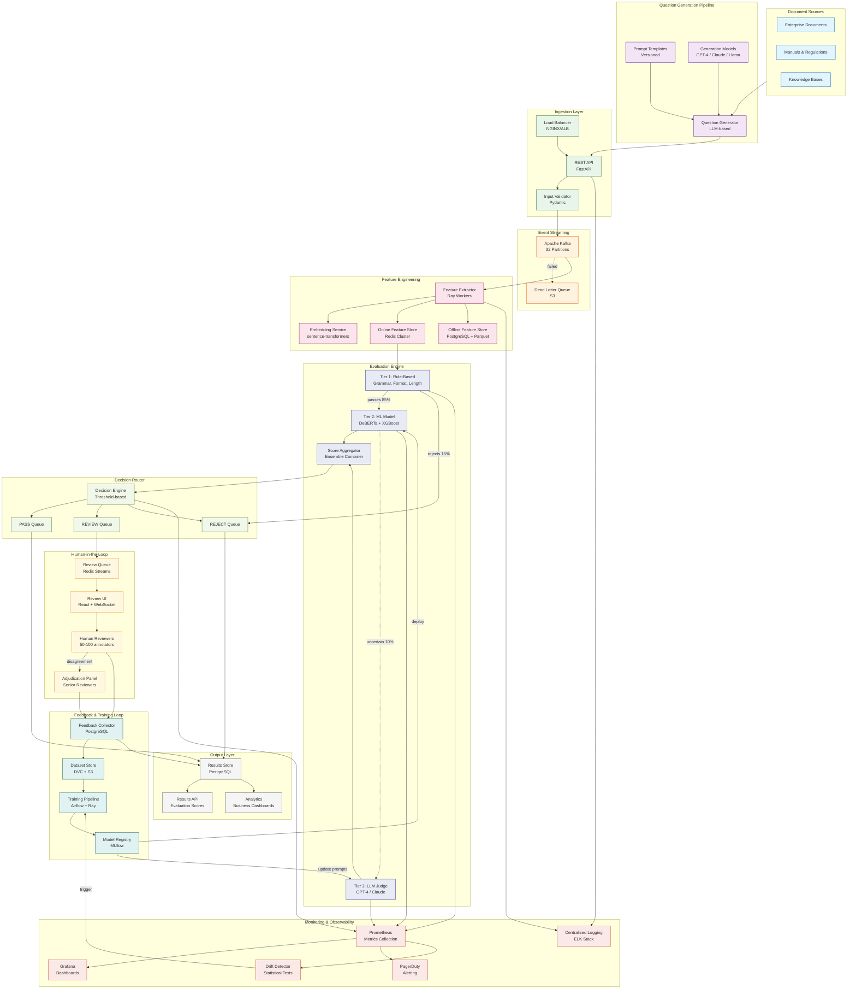
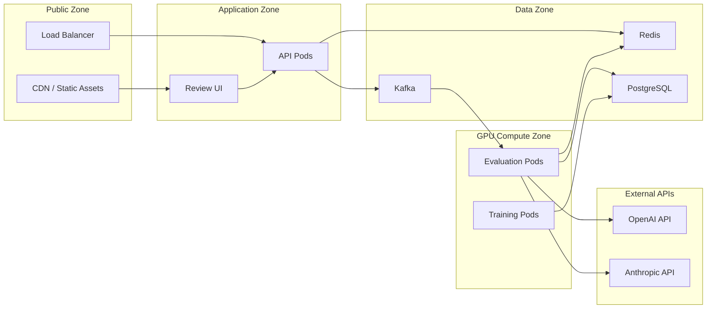

# System Architecture Diagram

## ML Evaluation Platform — Complete System Architecture

## Component Details

### Service Inventory

| Service | Technology | Scaling | SLA |
|---------|-----------|---------|-----|
| Load Balancer | NGINX / AWS ALB | Managed | 99.99% |
| API Service | FastAPI (Python 3.11) | HPA: 2-20 pods | 99.9% |
| Kafka Cluster | Apache Kafka 3.x | 32 partitions, RF=3 | 99.95% |
| Feature Extractor | Ray Workers (Python) | Auto-scale on queue depth | 99.9% |
| Embedding Service | sentence-transformers | GPU pods, batch inference | 99.9% |
| Redis Cluster | Redis 7.x | 6 nodes + replicas | 99.9% |
| Tier 1 Engine | Python rule engine | Co-located with API | 99.9% |
| Tier 2 Engine | DeBERTa + XGBoost | GPU pods (A100) | 99.9% |
| Tier 3 Engine | OpenAI/Anthropic API | Rate-limited, circuit breaker | 99.5% |
| Decision Router | Python service | Stateless, HPA | 99.9% |
| Review UI | React + Next.js | CDN + 3 pods | 99.9% |
| Feedback DB | PostgreSQL 15 | Primary + 2 read replicas | 99.9% |
| Training Pipeline | Airflow + Ray | On-demand GPU | Best effort |
| MLflow | MLflow 2.x | Single instance + S3 | 99.5% |
| Prometheus | Prometheus + Thanos | HA pair | 99.9% |
| Grafana | Grafana 10.x | 2 pods | 99.5% |

### Network Architecture

### Data Flow Summary

1. **Ingestion:** Documents → Question Generator → API → Kafka
2. **Feature Computation:** Kafka → Feature Extractor → Redis (online) + PostgreSQL (offline)
3. **Evaluation:** Features → Tier 1 → Tier 2 → (optional) Tier 3 → Score Aggregation
4. **Routing:** Scores → Decision Router → Pass / Review / Reject queues
5. **Human Review:** Review queue → UI → Reviewer → Feedback Collector
6. **Feedback Loop:** Feedback → Dataset Store → Training Pipeline → Model Registry → Deploy
7. **Monitoring:** All services → Prometheus → Grafana + Alerts → Drift Detection → Retrain trigger
